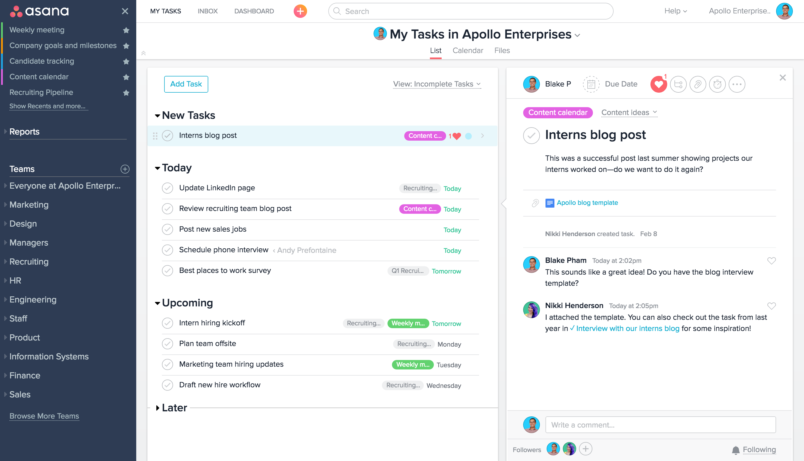

## Asana

Asana - онлайн сервис для управления задачами и проектами , был основан Дастином Московицем в 2008 году. Сервис позиционируется как инструмент для командной работы над проектами. На момент написания мастерской работы существует несколько планов подписки:

* Basic - бесплатная версия обладает меньшим функционалом и имеет ограничение 15 человек, которым можно дать доступ к проекту
* Premium, Business - платные версии с оплатой за 1 пользователя который имеет доступ к проекту. Между собой отличаются ценой и более расширенным функционалом, возможностью интегрции дополнительных сервисов.
* Enterprise - подписка для крупных компании, максимальный функционал и возможность настраивать функционал для каждого пользователя

Приложение реализует возможность управлять проектами без классического применения электронной почты для координации выполнения задач.

