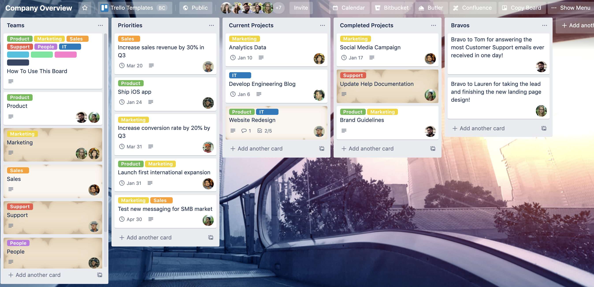

## Trello

Trello - отличный онлайн иструмент для управления проектами построенный про принципу канбан-досок. Данное приложение удобно для небольших команд которые разрабатывают програмный продукт. Для крупного предприятия в котором необходимо чтобы взаимодействовало большое количество людей и задачи предприятия не стандартизированы это приложение не подходит. С помощью Trello на таком предприятии будет сложно управлять задачами, т.к. система канбан-досок подходит для производства в котором необходимо показать что надо производить когда и сколько.
Существует бесплатная и платная версия приложения, отличаются количеством пользователей которые имеют доступ к доске проекта и количеством сервисов которые можно интегрировать.

